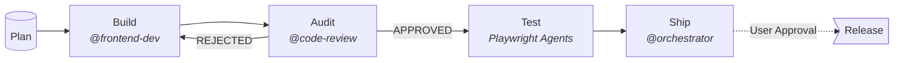

# OpenCode Landing Page Template


Vanilla HTML/CSS/JS landing page, powered by [Vite](https://vitejs.dev) and
built for the [OpenCode](https://opencode.ai) multi-agent pipeline — planning,
code generation, review, and automated E2E testing. WCAG 2.1 AA, modular
architecture, no framework lock-in.

```bash
npm install && npm run setup    # deps + codegraph index + playwright browsers
opencode                        # start building with AI agents
```

---

## Getting Started

1. **Create repo** — Click ["Use this template"](https://github.com/KiKDraS/opencode-landing-page-template/generate) on GitHub
2. **Clone & install** — `git clone <your-repo> && cd <your-repo> && npm install && npm run setup`
3. **Git Flow branches** — `git checkout -b develop && git push -u origin develop`
4. **Connect OpenCode** — `opencode` then `/connect` → sign in at [opencode.ai/auth](https://opencode.ai/auth)
5. **Start dev server** — `npm run dev` → open `http://localhost:5173`

---

## Commands

```bash
npm run dev       # Start dev server
npm run build     # Production build → dist/
npm run preview   # Preview production build locally
```

### Context7 API Key

```bash
echo "<your-context7-api-key>" > .opencode/secrets/context7-api-key
```

The MCP server reads the key from this file at startup via
`{file:.opencode/secrets/context7-api-key}` in `opencode.json`.

#### Where to Get an API Key

1. Go to [context7.com](https://context7.com)
2. Sign up for a free account
3. Copy your API key from the dashboard
4. Paste it into the command above

#### How the File-Based Key Works

OpenCode's `{file:path}` syntax reads the file content and substitutes it as a
string at config parse time. This means:

- **No environment variables needed** — the key stays inside the project
- **Gitignored** — `.opencode/secrets/` is tracked but its contents are ignored
  (see `.opencode/secrets/.gitignore`)
- **Portable** — clone the repo, add your key, done. No global config required

#### Enabling Context7

Context7 is the **only MCP server disabled by default** (requires an API key).
Enable it in `opencode.json`:

```json
"context7": {
  "type": "remote",
  "url": "https://mcp.context7.com/mcp",
  "headers": {
    "CONTEXT7_API_KEY": "{file:.opencode/secrets/context7-api-key}"
  },
  "enabled": true
}
```

To disable it later, set `"enabled": false` or remove the block entirely.

#### Notes

- The API key file must be **plain text** — no `.js` extension, no `export`,
  just the raw key string
- If the file doesn't exist, OpenCode will fail to parse the config with an
  error like `bad file reference: "{file:...}" <path> does not exist`
- Context7 uses `{file:...}` for the API key — the same pattern is also used
  elsewhere in the project (e.g., prompts in agent definitions), so it's worth
  understanding how it works

---

## GitHub Token (PR Creation)

The `@release-manager` agent creates Pull Requests to merge feature branches
into `develop`. It uses a hybrid approach: the `gh` CLI when available, or
`curl` + GitHub REST API as a portable fallback.

### How It Works

The agent resolves the GitHub token in this priority order:

1. **`.opencode/secrets/github-token`** — explicit secret file (recommended)
2. **Git credential helper** — zero config, works if `git push` already works
3. **`GITHUB_TOKEN` environment variable** — shell profile export

If none are found, the agent will report a clear error with setup instructions.

### Setup (Option 1: Secret File)

Create a [GitHub personal access token](https://github.com/settings/tokens) with
`repo` scope, then:

```bash
echo "<your-github-token>" > .opencode/secrets/github-token
```

The file is gitignored — your token stays local.

### Setup (Option 2: Zero Config)

If you can already `git push` to GitHub, the agent will use your existing
credentials automatically via the git credential helper. No additional setup
needed.

### Setup (Option 3: Environment Variable)

Add to your `~/.zshrc` or `~/.bashrc`:

```bash
export GITHUB_TOKEN="ghp_xxxxxxxxxxxx"
```

### Do I Need the `gh` CLI?

No. The `gh` CLI ([GitHub's official tool](https://cli.github.com/)) is
optional. If installed, the agent uses it for cleaner PR commands. If not, it
falls back to `curl` + GitHub REST API — which works on any system with `curl`
(macOS, Linux, Windows Git Bash).

---

## Troubleshooting

### `{file:...}` reference: "does not exist"

```
Error: bad file reference: "{file:.opencode/secrets/context7-api-key}" ... does not exist
```

OpenCode's `{file:path}` substitution reads the file and inlines its content. If
the file doesn't exist, the config fails to load.

**Fix:** Create the file as a plain text file (no `.js` extension, no `export`):

```bash
echo "<your-api-key>" > .opencode/secrets/context7-api-key
```

### Config file is not valid JSON

```
Error: Config file at .../opencode.json is not valid JSON
```

**Fix:** Validate your `opencode.json` syntax:

```bash
npx jsonlint opencode.json
```

Or use `jq`:

```bash
jq . opencode.json > /dev/null && echo "valid"
```

Common causes: trailing commas, missing commas between fields, unquoted keys.

### MCP server not connecting

If an agent reports that an MCP tool is unavailable (e.g., `codegraph_explore`,
`playwright-test*`, or `query-docs`):

1. **Check if the server is enabled** — verify `"enabled": true` for the
   specific MCP server in `opencode.json`. Only `context7` is opt-in by default.
2. **Restart the session** — MCP server configuration is read at startup.
   Changes require a new session.
3. **Check the server is installed** — Playwright and Codegraph need local
   dependencies (both installed by `npm run setup`):
   - Playwright: `npm run setup` (or `npx playwright install` directly)
   - Codegraph: `npm run setup` (`npx @colbymchenry/codegraph init`)

### Playwright browsers not found

```
Error: browserType.launch: Executable doesn't exist at ...
```

**Fix:** Run the setup command to install Playwright browsers:

```bash
npm run setup
```

### Port already in use

If a local MCP server fails to start, another process may be using its port.
Playwright MCP and Codegraph use ephemeral ports by default — if the issue
persists, restart your terminal or check with:

```bash
lsof -i :<port>
```

---

## Project Structure

```
├── src/
│   ├── assets/           # Images, SVGs, fonts (Vite-processed)
│   ├── styles/           # CSS layers: boilerplate/ → layout/ → components/
│   │   └── main.css      # Entry point (@import aggregator)
│   ├── js/               # JS modules: layout/ → components/ → utils/
│   └── main.js           # Vite entry (initializes modules)
├── public/favicon/       # Favicon bundle (served as-is)
├── tests/                # Playwright specs (e2e/ + components/)
├── index.html            # HTML + SEO + JSON-LD structured data
├── specs/                # Test plans (written by playwright-test-planner)
├── vite.config.js        # Dynamic base path for GitHub Pages deploy
├── playwright.config.ts  # E2E test runner config
├── opencode.json         # Agent definitions, plugins & MCP servers
└── package.json
```

---

## AI Agent Pipeline

| Agent | Role |
|-------|------|
| **orchestrator** | Plans architecture, delegates tasks, manages releases |
| **frontend-dev** | Builds features across HTML, CSS, JS layers |
| **code-review** | Audits against skill checklists (APPROVED / REJECTED) |
| **release-manager** | Creates PRs, branches, merges, tags |
| **playwright-test-planner** | Explores live UI, writes test plans to `specs/` |
| **playwright-test-generator** | Converts plans → executable `.spec.ts` files |
| **playwright-test-healer** | Runs tests, debugs, auto-fixes failures |



**Pipeline:** Plan → Build → Audit (loops if rejected) → Test (plan → generate → execute → self-heal) → Ship (user approval required for release).

---

## Tools & Configuration

| Tool | What it does | Setup |
|------|-------------|-------|
| **[Ponytail](https://github.com/DietrichGebert/ponytail)** | Makes AI write minimal code — YAGNI, stdlib-first, shortest diff | Pre-configured. Commands: `/ponytail [lite\|full\|ultra\|off]`, `/ponytail-review`, `/ponytail-audit`, `/ponytail-debt`, `/ponytail-help` |
| **[Codegraph](https://github.com/colbymchenry/codegraph)** | SQLite code graph — AI gets surgical context, fewer round-trips | `npm run setup` builds index. Re-run if stale. `.codegraph/` is gitignored. |
| **[Playwright](https://playwright.dev)** | Browser automation — agents explore UI, generate tests, self-heal failures | Pre-configured. Tests in `tests/e2e/` and `tests/components/`. |
| **[Context7](https://context7.com)** | Live library docs for AI (React, Next.js, Prisma, Tailwind, etc.) | Needs API key. [Sign up](https://context7.com), then `echo "<key>" > .opencode/secrets/context7-api-key` and enable in `opencode.json`. |
| **GitHub Token** | PR automation for `@release-manager` | Optional. Auto-detects `gh` CLI → git credentials → `GITHUB_TOKEN`. |

> **Note:** Context7 is the only tool disabled by default (needs an API key).
> Everything else works after `npm install && npm run setup`.

---

## Git Workflow

Strict **Git Flow**. All merges through Pull Requests — no direct commits to `main` or `develop`.

| Branch | From → To | Purpose |
|--------|-----------|---------|
| `main` | — | Production (merge only from `release/*` or `hotfix/*`) |
| `develop` | — | Daily integration branch |
| `feature/*` | from `develop` → PR to `develop` | New features |
| `release/*` | from `develop` → PR to `main` + back-PR to `develop` | Deployment prep |
| `hotfix/*` | from `main` → PR to `main` + back-PR to `develop` | Urgent production fixes |

After merge, the source branch is deleted (local + remote). **`main` and `develop` are never deleted.**

| Agent | Branch authority |
|-------|-----------------|
| `@frontend-dev` | `feature/*` and `hotfix/*` only |
| `@release-manager` | All remote git operations (PR, push, merge, tag, delete) |
| `@orchestrator` | Decides **when** to merge or release — always requires user approval |
| `@code-review` | All merges need APPROVED status first |

---

## Contributing

See [CONTRIBUTING.md](./CONTRIBUTING.md) for guidelines — scope (agent
infrastructure only, not demo content), Git Flow, review criteria, and how to
submit changes.

---

## Deployment

**Recommended: dual-repo flow** — private source repo, public deploy repo.

1. Create a **public** repo named `<your-project>-page` on GitHub (empty, no README)
2. Enable **GitHub Pages** → **GitHub Actions** in that repo's Settings
3. Add this workflow to your **private source repo** (`.github/workflows/deploy.yml`):

```yaml
name: Deploy to GitHub Pages
on:
  push:
    branches: [main]
permissions:
  contents: read
  pages: write
  id-token: write
jobs:
  build:
    runs-on: ubuntu-latest
    steps:
      - uses: actions/checkout@v4
      - uses: actions/setup-node@v4
        with: {node-version: 20, cache: npm}
      - run: npm ci && npm run build
      - uses: actions/upload-pages-artifact@v3
        with: {path: dist}
  deploy:
    needs: build
    runs-on: ubuntu-latest
    environment:
      name: github-pages
      url: ${{ steps.deployment.outputs.page_url }}
    steps:
      - id: deployment
        uses: actions/deploy-pages@v4
```

4. Push to `main` — the workflow builds and deploys automatically
5. Site at `https://<username>.github.io/<your-project>-page/`

The `base: /${folderName}-page/` in `vite.config.js` automatically matches the
public repo name.

> **Warning:** Deploying from the same repo (no `-page` suffix) is possible but
> makes source code public. Not recommended.

---

## Skills & Guidelines

All generated code complies with these skills (defined in `.opencode/skills/`):

| Skill | What it enforces |
|-------|-----------------|
| **HTML/CSS Best Practices** | Semantic HTML5, modular CSS layers, custom properties, mobile-first |
| **Accessibility WCAG** | WCAG 2.1 AA — contrast ≥4.5:1, keyboard nav, ARIA landmarks, skip links |
| **Modern JavaScript** | ES6+, pure functions, async/await, declarative pipelines, event delegation |
| **Frontend Design** | No generic AI slop — bold typography, asymmetric layouts, distinctive palette, CSS motion |
| **SEO** | JSON-LD structured data, semantic headings, `robots.txt`, sitemap, canonical URLs |
| **Context7 MCP** | Live library docs for setup, API syntax, migrations (not for refactoring/debugging) |
| **Playwright** | User-facing locators, Page Object Model, web-first assertions, test isolation |

---

## Troubleshooting

| Error | Fix |
|-------|-----|
| `bad file reference: "{file:...}"` | `echo "<your-key>" > .opencode/secrets/context7-api-key` |
| `opencode.json is not valid JSON` | `npx jsonlint opencode.json` — check for trailing commas, unquoted keys |
| `browserType.launch: Executable doesn't exist` | `npm run setup` (installs Playwright browsers) |
| MCP server tool unavailable | Check `"enabled": true` in `opencode.json`, restart session, run `npm run setup` |
